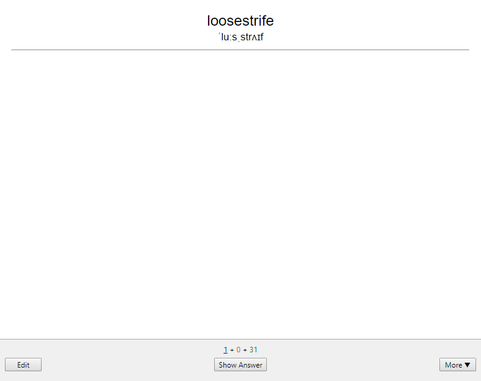
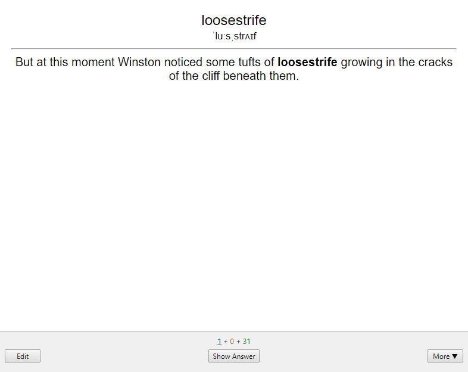
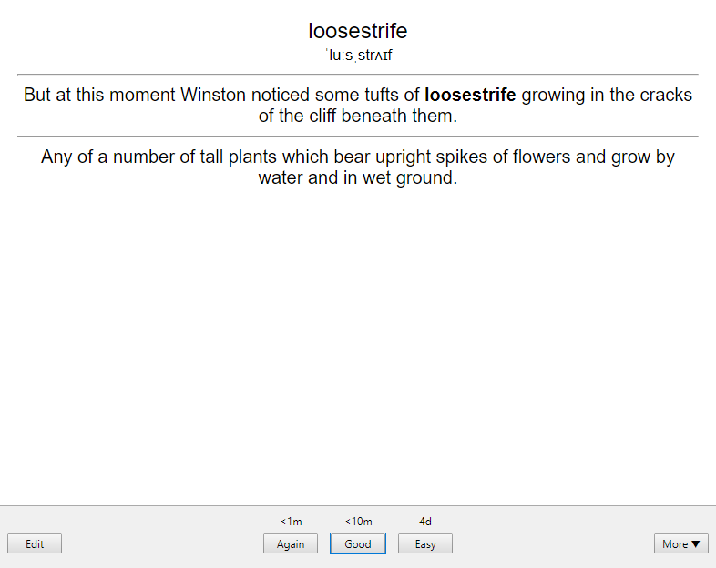

# Convert Kindle Vocab to Anki
## Description
The purpose of this project is for porting the vocabs you learned from your Kindle to [Anki](https://apps.ankiweb.net).

In particular, this script converts `vocab.db` into a format Anki can understand and import.

|  |  |  |
| ------------------------------------ | --------------------------------------------------------- | ---------------------------------- |
| Front of the card                    | Hover to reveal example sentence                          | Back of the card                   |

### In Kindle
Your Kindle records down each word you search for and you can review them in Vocab Builder. These words are written into the database `kindle:/system/vocab.db`, specifically in the `LOOKUPS` database table. The ID and context of the word are cross-referenced to the `WORDS` database table.

### In Anki
Create a new note type for Anki for the import.
1. Pick `Basic (and reversed card)`.
2. In the `Fields...` options, adjust the fields to:

|Order|Field Name|Explanation|
|:---:|:---------|:------|
|1    |Word      |The Vocab, which is not necessary the root word|
|2    |Pronunciation |The IPA of the word|
|3    |Example Sentence|The context sentence where you found the word|
|4    |Meaning   |Definition of the word|

3. In the `Cards...` option, the card templates are as follows (copy and paste them, they work as is).

#### Front Template
```HTML
<big class="word">{{Word}}</big><br>
<small class="ipa">{{Pronunciation}}</small><br>

<hr>
<div class='spoiler'>{{Example Sentence}}</div>
```

#### Styling (shared between cards)
```HTML
.card {
 font-family: arial;
 font-size: 20px;
 text-align: center;
 color: black;
 background-color: white;
}

.spoiler { 
  color: white;
}

.spoiler:hover{
  color: black;
}
```

#### Back Template
```HTML
<big class="word">{{Word}}</big><br>
<small class="ipa">{{Pronunciation}}</small><br>

<hr>
{{Example Sentence}}

<hr id=answer>

{{Meaning}}

<div style='color: white;' class='spoiler'>{{Example Sentence}}</div>
```


### Putting it together
`Word` and `Example Sentence` are extracted from the Kindle database file;
`Phonetics` and `Meaning` are queried using a [3rd-party website using Google's Dictionary API](https://googledictionaryapi.eu-gb.mybluemix.net/).

The script takes the ID of the word from `LOOKUPS` to find the actual word and its context from `WORDS`, queries the API for phonetics and meaning, and writes the 4 fields, tab-separated. However, it does not follow the proper format of a `.tsv` file as quotes are taken as is without escaping.

## Usage
1. Export `WORDS.csv` and `LOOKUPS.csv` from `system/vocab.db` manually.
	- Keep column names in the first line for both files.
	- Pick 'Tab' as the Field Separator.
	- Pick " as the quote character.
2. Set up your Anki with the new note type as above.
3. Put `WORDS.csv`, `LOOKUPS.csv` and `convert_db_to_tsv.py` in the same folder.
4. Run `convert_db_to_tsv.py`. Use `--help` for usage information.
5. Import `Kindle_Vocab.tsv` in Anki, pick the note type you made, and allow HTML in fields.

### Bugs
The Google API does not contain information for all words. `Error:` is filled instead so you can find them easily. I recommend importing all the words, including the errorneous ones, and then filter "error" in Anki and fix them.

## Bulk Editing Your Anki Database When You Suck At SQL
It is possible to edit all your cards in bulk with the Anki Desktop client and a database editor.
1. Backup your Anki database file in `%AppData%\Anki2\User\collection.anki2`.
2. Open the database with your database editor. Export the `notes` table to `notes.csv`.
3. Do your bulk editing as required.
4. Rename the `notes` table to `notes_old` for reference later.
5. Import the edited `notes.csv` into the database.
6. Verify that the `tags` and `data` fields do not contain NULL. Otherwise, execute the following SQL code:
```SQL
update notes
set tags = "" where tags IS NULL;
update notes
set data = "" where data IS NULL;
```
7. Modify the `notes` table to have the fields the same as `notes_old`.
8. You may choose to delete `notes_old` as it is no longer required.
9. Save the database.
10. In Anki, force a one-way sync through `Preferences > Network > On next sync, force changes in one direction`.


## Ideas for Future Work
* Multi-threading
* Automate extracting tables from database
* Using Merriam-webster dictionary's API
* Parse the list for new vocabs only
