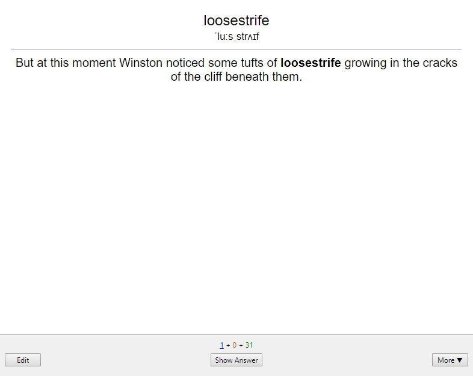
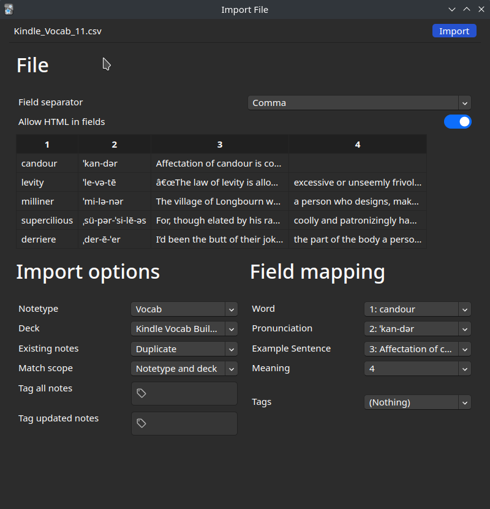

# Convert Kindle Vocab to Anki
## Purpose
The purpose of this project is for importing the vocabs you learned from your Kindle to [Anki](https://apps.ankiweb.net).

In particular, this script converts `vocab.db` into a format Anki can understand and import.

|  |  |  |
|:---:|:---:|:---:|
| Front of the card | Hover to reveal example sentence | Back of the card |

## How it works
### In Kindle
Your Kindle records down each word you highlight to view its definition, and you can review them in Kindle's in-built Vocab Builder. These words are written into the database `kindle://system/vocabulary/vocab.db`, specifically in the `LOOKUPS` database table. The word ID and usage of the word are cross-referenced to the `WORDS` database table.

### In Anki
Create a new note type for Anki for the import.
1. Pick `Basic (and reversed card)`.
2. In the `Fields...` options, adjust the fields to:

|Order|Field Name|Description|
|:---:|:---------|:------|
|1    |Word      |Word entry as in the Merriam-Webster dictionary|
|2    |Pronunciation |Merriam-Webster's technical representation of [pronunciation](https://www.merriam-webster.com/assets/mw/static/pdf/help/guide-to-pronunciation.pdf)|
|3    |Example Sentence|The sentence where the word was highlighted|
|4    |Meaning   |Definition(s) of the word|

3. In the `Cards...` option, the card templates are as follows (copy and paste them).

#### Front Template
```HTML
<big class="word">{{Word}}</big><br>
<small class="ipa">{{Pronunciation}}</small><br>

<hr>
<div class='spoiler'>{{Example Sentence}}</div>
```

#### Styling (shared between cards)
```HTML
.card {
 font-family: arial;
 font-size: 20px;
 text-align: center;
 color: black;
 background-color: white;
}

.spoiler { 
  color: white;
}

.spoiler:hover{
  color: black;
}
```

#### Back Template
```HTML
<big class="word">{{Word}}</big><br>
<small class="ipa">{{Pronunciation}}</small><br>

<hr>
{{Example Sentence}}

<hr id=answer>

{{Meaning}}

<div style='color: white;' class='spoiler'>{{Example Sentence}}</div>
```


### Putting it together
`Word` and `Example Sentence` are extracted from the Kindle database file;
`Phonetics` and `Meaning` are queried using [Merriam-Websters' API](https://dictionaryapi.com/products/json).

The script takes the ID of the word from `LOOKUPS` to find the actual word and its context from `WORDS`, queries the API for phonetics and meaning, and writes the 4 fields to a comma-separated values (CSV) file.

## How to use
1. Install Python 3.
2. Copy your Kindle database file `kindle://system/vocabulary/vocab.db` to an accessible location.
3. Set up your Anki with the new note type as above.
4. Run `./convert.py` with Python 3. Use `--help` for usage information.
5. Import `import.csv` in Anki, pick comma as the field separator, pick the note type you made, and allow HTML in fields.


### --help
```
usage: convert.py [-h] [--log {debug,info,warning,error,critical}] [-k KEY] [-o OUTFILE] [-d /path/to/vocab.db]
                  [-t /path/to/last_timestamp.txt]
                  {list,l} ...

Converts vocab.db from Kindle into a format Anki accepts. Refer to https://github.com/MrShiister/Convert-Kindle-Vocab-to-Anki for full
details.

positional arguments:
  {list,l}
    list (l)            Get definition of a list of word(s) and convert into a format Anki accepts.

options:
  -h, --help            show this help message and exit
  --log {debug,info,warning,error,critical}
                        Log level. The default level is info.
  -k KEY, --key KEY     Your dictionaryapi.com API Key
  -o OUTFILE, --outfile OUTFILE
                        Path to outfile
  -d /path/to/vocab.db, --vocabdb /path/to/vocab.db
                        Path to vocab.db
  -t /path/to/last_timestamp.txt, --timestamp-file /path/to/last_timestamp.txt
                        Path to file of the record the timestamp of last entry captured from vocab.db. This is used to record the last
                        time you ran this script, so you can filter to extract new words from the same database without extra effort.
                        Specify a non-existent file to ignore filter.

```
## Example Usage
```sh
[me@mycom anki]$ ./convert.py -o ./Anki/Kindle_Vocab.csv -d ./Anki/vocab.db
[*]     INFO: Writing to ./Anki/Kindle_Vocab.csv all words since 2022-09-24 17:48:48.312000: 191 words
[*]  WARNING: bollocking: Definition not found. Searching blocking instead...
[*]  WARNING: blagged: Definition not found. Searching blogged instead...
[*]  WARNING: lairy: Definition not found. Searching laired instead...
[*]  WARNING: bollockings: Definition not found. Searching blackings instead...
[*]  WARNING: dobbed: Definition not found. Searching dabbed instead...
[*]  WARNING: parp: Definition not found. Searching par instead...
[*]  WARNING: missish: Definition not found. Searching missis instead...
[*]  WARNING: dropt: Definition not found. Searching drop instead...
[*]     INFO: Writing timestamp of the final entry into ./last_timestamp.txt: 1682322892491
```
## Additional Details
- The script has a `list` subcommand that enables you to input a list of words (to search the Merriam-Webster API) instead of reading from a database.

- The API does not contain information for all words. If the definition of a word cannot be found, a warning is printed, and the closest substitute is searched instead. If no substitutes as available, only the `Word` field will be filled, leaving the rest blank. Run `./convert.py list` to see a sample.

- If the substitute word is wrong, you may want to use the `list` subcommand after you find the correct replacements. It will append to your `.csv` outfile.

- The `last_timestamped.txt` file tracks the timestamp of the last vocab that was processed by this script. This helps to minimise duplicates by only searching words after the mentioned timestamp when you use this script again on the same database.
## Bulk Editing Your Anki Database When You Suck At SQL
It is possible to edit all your cards in bulk with the Anki Desktop client and a database editor.
1. Backup your Anki database file in `%AppData%\Anki2\User\collection.anki2`.
2. Open the database with your database editor. Export the `notes` table to `notes.csv`.
3. Do your bulk editing as required.
4. Rename the `notes` table to `notes_old` for reference later.
5. Import the edited `notes.csv` into the database.
6. Verify that the `tags` and `data` fields do not contain NULL. Otherwise, execute the following SQL code:
```SQL
update notes
set tags = "" where tags IS NULL;
update notes
set data = "" where data IS NULL;
```
7. Modify the `notes` table to have the fields the same as `notes_old`.
8. You may choose to delete `notes_old` as it is no longer required.
9. Save the database.
10. In Anki, force a one-way sync through `Preferences > Network > On next sync, force changes in one direction`.


## Ideas for Future Work
- [x] Parallel processing
- [x] Automate extracting tables from database
- [x] Using Merriam-webster dictionary's API
- [x] Parse the list for new vocabs only
- [ ] Consider using Built-in dictionary
- [ ] Turn into an Anki plugin